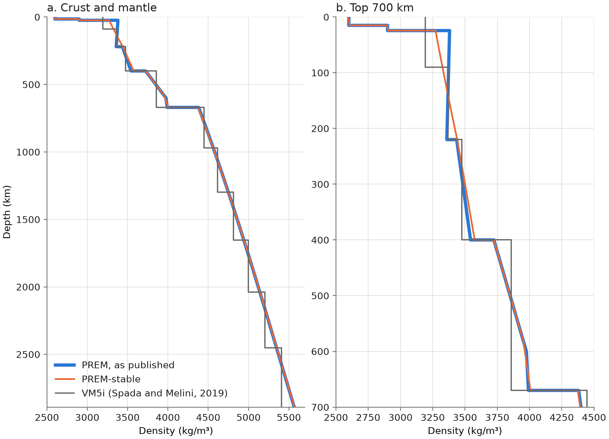

# A gravitationally stable PREM for GIA models

This note explains why we changed the density of PREM, how we changed it, and
how to use the two files `PREM.csv` and `PREM-stable.csv`. It is written for the
GIAMIP modelling groups.

## Why PREM needs a change

GIAMIP prescribes PREM (Dziewonski and Anderson, 1981) as the elastic structure
of several experiments. PREM's density comes from a fit to seismic and
free-oscillation data. Nothing in that fit makes the density stable in a model
where the mantle flows. The bottom line is, as the literature has shown (see cited papers), in some depth ranges it is not stable.

### The stability condition

The reference Earth is in hydrostatic equilibrium. That is the change in hydrostatic pressure with radius is,

$$\frac{dP}{dr} = -\rho g,$$

with $r$ the radius, $P$ the pressure, $\rho$ the density and $g$ gravity.

Move a small parcel of rock upward. The pressure on it decreases and it
expands. If the parcel exchanges no heat with its surroundings (adiabatic process), the bulk
modulus $\kappa$ sets the expansion, $d\rho/\rho = dP/\kappa$. With the
hydrostatic equation, the density of the parcel changes with radius as

$$\left(\frac{d\rho}{dr}\right)_{\mathrm{ad}} = -\frac{\rho^2 g}{\kappa}.$$

This is the Adams–Williamson gradient (Williamson and Adams, 1923). Compare it
with the density gradient of the model. If the density of the model decreases
upward faster than the adiabatic gradient, the parcel arrives denser than its
new surroundings and sinks back. The layer is stable. If the density of the
model decreases more slowly, or increases upward, the parcel arrives lighter
and continues to rise. The layer is unstable. A metric for the stability would be $e$:

$$e = 1 + \frac{\kappa}{\rho^2 g}\,\frac{d\rho}{dr}.$$

$e$ is one minus the Bullen parameter. A layer with $e < 0$ is stable, a layer
with $e = 0$ is adiabatic, and a layer with $e > 0$ is unstable.

In an elastic layer, the shear strength holds the parcel in place, and $e > 0$
has no effect. In a layer that flows, nothing holds the parcel. A displacement
then grows exponentially with time. This is a Rayleigh–Taylor instability, and
its growth rate increases as the viscosity decreases. In a Love-number
calculation it appears as a mode with a positive growth rate (even without any load, it never relaxes!), and the response
does not relax to its fluid limit (Plag and Jüttner, 1995; Vermeersen and
Mitrovica, 2000). Huang et al. (2023) show the same growing modes in a
finite-element GIA model.

An incompressible model has $\kappa \to \infty$. The adiabatic gradient is then
zero, and the condition becomes simple: density must not increase upward
(Vermeersen and Mitrovica, 2000). Incompressible models are therefore affected
only where PREM's density increases upward. Compressible models are affected
wherever $e > 0$.

### Where PREM fails

| Depth (km) | $e$ in PREM | Density excess over the adiabat (kg/m³) |
|---|---|---|
| 0 to 24.4, crust | 1 (constant density in each layer) | about 20 |
| 24.4 to 220 | 1.13 (density increases upward) | about 190 |
| 220 to 400 | 0.17 to 0.22 | 26 |
| 400 to 600 | −0.98 to −0.73 (stable) | 0 |
| 600 to 670 | 0.63 | 28 |
| 670 to 2891 | −0.01 to 0.03 | under 9 |

The layer between 24.4 and 220 km is the largest problem. It is unstable in
compressible and incompressible models. The layers between 220 and 400 km and
between 600 and 670 km affect compressible models only.

GIAMIP leaves compressibility open. Groups with compressible models will see
the instability, and groups with incompressible models will see less of it or
none. The difference then appears in the model spread as if it were a real
difference between the models. With the protocol viscosities the effect is
small. At low viscosities it becomes large. In our own codes the PREM response
at low degree misses its fluid limit by up to 3.4 per cent. A compressible
G-ADOPT model with a weak mantle developed a flow that continued to grow.

## Description of what was changed by ANU-GADOPT team

A GIA model uses density $\rho$, bulk modulus $\kappa$, shear modulus $\mu$ and
a viscosity. Gravity follows from the density. We change only $\rho$. The
moduli $\kappa$ and $\mu$ stay as in PREM at every depth, so the elastic
stiffness of the model is PREM's.

PREM gives $V_P$ and $V_S$ instead of the moduli. The relations are
$\mu = \rho V_S^2$ and $\kappa = \rho V_P^2 - \tfrac{4}{3}\mu$. With fixed
moduli and a new density, both speeds change by about $-\tfrac{1}{2}\,
\Delta\rho/\rho$. The $V_P$ and $V_S$ in `PREM-stable.csv` are these new
speeds. This table therefore, is purely for the purposes of GIA modelling where the target is to measure the Earth's response to external load.

Here we also note that we change the density of the crust and the whole mantle, from the surface to the
core-mantle boundary at 2891 km. Below 670 km, PREM is close to adiabatic, with $e$ up to 0.029, and the
change there is a few kg/m³. We still include it, because a lower mantle with a low viscosity can show
the instability over a long run. With the correction, every layer of the crust and the mantle is stable.
The core stays PREM.

### The rule

The density at the nodes between the surface and the core-mantle boundary is
the solution of a least-squares problem. It is the density closest to PREM,

$$\min \sum_i w_i \left(\rho_i - \rho_i^{\mathrm{PREM}}\right)^2,$$

where $w_i$ is the mass of the shell that node $i$ represents. Three
conditions apply.

1. Every interval between two nodes is stable or adiabatic:

   $$\frac{\rho_{i+1} - \rho_i}{r_{i+1} - r_i} + \frac{\bar\rho^2\,\bar g}{\bar\kappa} \le 0,$$

   where the bar is the mean of the two nodes. This is the discrete form of
   $e \le 0$.
2. At every discontinuity, the density below is at least the density above.
   An inverted jump between two flowing layers gives a mode that grows about
   ten times faster than the same density excess spread over a layer.
3. The mass of the crust and the mantle is PREM's. The total mass of the
   Earth, the surface gravity and the gravity in the core therefore do not
   change. One condition covers the whole range, so mass can move between the
   upper and the lower mantle.

Condition 1 contains $g$, and $g$ depends on the density. We solve the problem
in a loop. Gravity comes from the current density, the least-squares problem
with these linear conditions gives a new density, and the loop repeats. Five
iterations bring the density to within 2e-5 kg/m³ of its final value.

### A note on the upper most layers (crust and lithosphere)

A lithosphere that does not flow carries no instability, whatever its
density. A correction below a fixed lid (elastic lithosphere or high viscosity), for example 60 km, is therefore
enough for a 1D model with a rigid lid of at least that thickness. However, this is not
enough for every GIAMIP model, including GADOPT. In a 3D model the lithosphere is thinner in some
regions, and there the shallow mantle with $e = 1.13$ flows. In a model that
gives the lid a high but finite viscosity, as G-ADOPT does, the lid flows
slowly, and a long run can show the instability. A correction to the surface
makes the table stable for every lid thickness and every lid viscosity.

The crust is included for the same reason. Each crustal layer of PREM has a
constant density, and in a compressible model a constant density is
super-adiabatic ($e = 1$). The correction changes the crust by about
10 kg/m³ and keeps the large density jumps at 15 and 24.4 km.

## The result

*Density of PREM as published (blue), of PREM-stable (orange) and of VM5i
(grey; Spada and Melini, 2019, Table 2). a. The crust and the mantle, 0 to
2891 km. b. The top 700 km, where the change is largest. Where PREM and
PREM-stable agree, the orange line lies on the blue line. VM5i averages PREM
over 11 layers of constant density. Below 220 km its density is 0.4 to 0.8 per
cent lower than PREM. A layer of constant density is stable only in an
incompressible model. In a compressible model it is steeper than the adiabatic
gradient ($e = 1$), so VM5i is not stable in a compressible code.*

| Depth (km) | Density change (kg/m³) |
|---|---|
| 0 to 24.4, crust | −9 to +10 |
| 24.4 to 220 | −109 at 24.4 km, +81 at 220 km |
| 220 to 400 | +4 to +32 |
| 400 to 600 | +0.3, and down to −12 between 590 and 600 km |
| 600 to 670 | −12 to +16 |
| 670 to 771 | −7 to −5 |
| 771 to 2741 | −5 to +3 |
| 2741 to 2891, D'' | +2 to +2.5 |

The largest $e$ in the crust and the mantle is 2e-9. In PREM it is 1.13.
The density jump at 220 km becomes zero, the jump at 400 km decreases from
180 to 149 kg/m³, and the jump at 670 km decreases from 389 to 366 kg/m³. The
lid between 24.4 and 80 km becomes 1.7 to 3.2 per cent lighter. Between about
2350 and 2891 km, PREM is already stable, with $e$ down to −0.011. There the
correction gives the adiabatic gradient, $e = 0$, which is the stable density
closest to PREM after the change above it. The total mass and the surface
gravity are PREM's. Gravity changes by at most 5.5e-3 m/s², at about 140 km
depth. $V_P$ and $V_S$ change by −1.2 to +1.7 per cent.

## How to use the files

`PREM.csv` is PREM as published, with the ocean replaced by the upper crust.
`PREM-stable.csv` is the stable model. The two files have the same 339 nodes,
so they can be compared row by row.

| Column | Quantity | Unit |
|---|---|---|
| `radius_m` | radius | m |
| `depth_km` | depth | km |
| `region` | index of the PREM region in `prem1981.py` | |
| `rho_kg_m3` | density | kg/m³ |
| `vp_m_s` | P-wave speed | m/s |
| `vs_m_s` | S-wave speed | m/s |
| `kappa_Pa` | bulk modulus | Pa |
| `mu_Pa` | shear modulus | Pa |
| `g_m_s2` | gravity | m/s² |

- The rows go from the centre to the surface.
- Every boundary between PREM regions has two rows with the same radius. The
  first row is the side below the boundary, the second row is the side above.
  Some of these boundaries have no density jump, and there the two rows are
  equal.
- The nodes are at most 10 km apart from the surface to the core-mantle
  boundary, and at most 100 km apart in the core.
- Between the surface and the core-mantle boundary, interpolate the density
  linearly between nodes. The gravity column is exact for that density. If your code computes
  gravity from the density with the trapezoid rule, the result differs from
  the column by at most 3e-5 of its value.
- Use $\kappa$ and $\mu$ from the file. If you read $V_P$ and $V_S$, read them
  from the same file as the density. Do not combine the density of
  `PREM-stable.csv` with the $V_P$ and $V_S$ of another PREM table. That
  combination gives moduli that are not PREM's.
- An incompressible model uses $\rho$ and $\mu$ only. The density of
  `PREM-stable.csv` increases with depth everywhere, so it is stable for an
  incompressible model as well.
- The files contain no viscosity and no attenuation.

## References

Dziewonski, A. M. and Anderson, D. L. (1981). Preliminary reference Earth
model. *Physics of the Earth and Planetary Interiors* 25, 297–356.

Huang, P., Steffen, R., Steffen, H., Klemann, V., Wu, P., van der Wal, W.,
Martinec, Z. and Tanaka, Y. (2023). A commercial finite element approach to
modelling Glacial Isostatic Adjustment on spherical self-gravitating
compressible earth models. *Geophysical Journal International* 235, 2231–2256.

Plag, H.-P. and Jüttner, H.-U. (1995). Rayleigh–Taylor instabilities of a
self-gravitating Earth. *Journal of Geodynamics* 20, 267–288.

Spada, G. and Melini, D. (2019). SELEN4 (SELEN version 4.0): a Fortran program
for solving the gravitationally and topographically self-consistent sea-level
equation in glacial isostatic adjustment modeling. *Geoscientific Model
Development* 12, 5055–5075. https://doi.org/10.5194/gmd-12-5055-2019

Vermeersen, L. L. A. and Mitrovica, J. X. (2000). Gravitational stability of
spherical self-gravitating relaxation models. *Geophysical Journal
International* 142, 351–360.

Williamson, E. D. and Adams, L. H. (1923). Density distribution in the Earth.
*Journal of the Washington Academy of Sciences* 13, 413–428.
